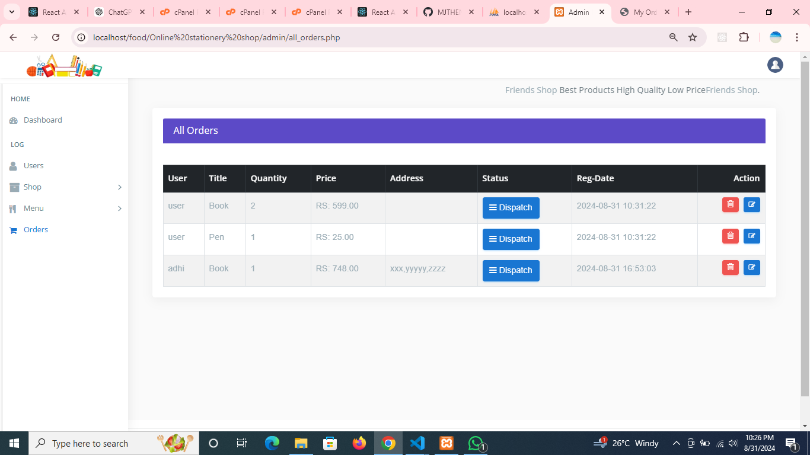

# Online-Food-Ordering-System-in-PHP

Online Food Ordering System in PHP

### Available Features:

<li> Online Food Preview
<li> User Account Create
<li> Food Order 
<li> Food Order Manage
<li> Admin Panel
<li> Deshbord
<li> User Management
<li> Resturent Add
<li> Resturent Management
<li> Resturent Category Add
<li> Catagory Management
<li> Menus
<li> Order
<li> Order Management
<li> Order and Delivary Management
<li> Etc.

### Instructions: How to Run?

1.  After you finish downloading the project, unzip the project file and head over to your XAMPP/Laragon directory.  
2.  There you’ll find a folder named “htdocs/www”.  
3.  Inside the “htdocs” folder, paste the project folder (not the .zip one, but the extracted one).  
4.  Open your favorite browser; we recommend using Google Chrome or Mozilla Firefox.  
5.  Then, go to the URL “http://localhost/phpmyadmin“.  
6.  Create a Database "code_camp_bd_fos".  
7.  Click on the “Import” tab and choose the database file (.sql) which is provided under the folder naming “DATABASE FILE”.  
8.  After setting up all these, go to the URL “http://localhost/[ PROJECT_FOLDER_NAME ]/“  
9.  All the login details are provided inside the project folder, check that out and enter them in order to use it.  

### Admin Login Info Details

Email : admin   Password: 12345678 (this hashpassword)
## Frontend Preview

### User Login

